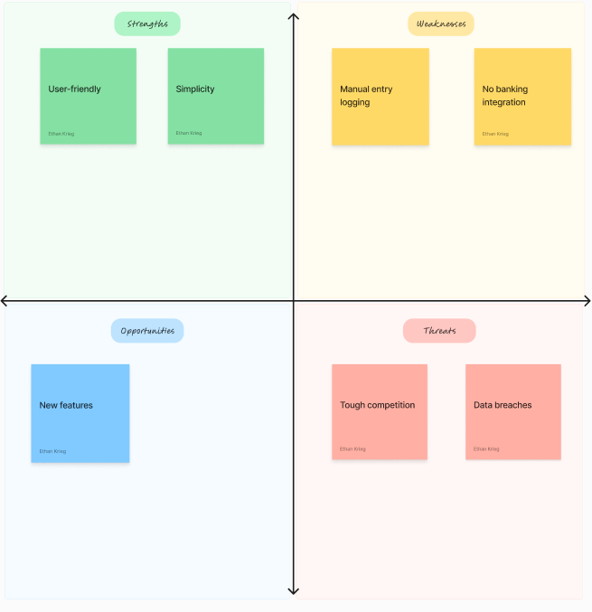

# Savvy Coders Capstone Project: PocketWatch - Expense Tracker

## Definition statement
This application addresses the challenge of scattered and difficult-to-track expense and income
information by providing a user-friendly tool that enables individuals and small business owners to
track, categorize, and analyze their saving and spending trends.

## Define Audience
* Individuals
* Small Business Owners

## Application Outline

### Color Palette
* Primary Color - Honeydew - F1FAEE
* Secondary Color - Non Photo blue - A8DADC
* Font Color - Berkeley blue - 1D3557

### Fonts
* Nunito Sans

### Icons
* There will be icons throughout the application. The navigation bar will have 3-4 icons or a
Hamburger button. The different income and expense types will have icons to classify them.

### Navigation
* Navigation will run from the main dashboard to the other views. Such as the transactions page,
incomes page, and expenses page.

### User Story Map
* 

### Research
* Copilot
* What I liked:
    * The styles of the application(design, transaction tags, icons)
    * User determined budgets for specific categories
    * Investment account integration
* What I didn't like:
    * The desktop version's main dashboard displays an excessive amount of information

* Tiller
* What I liked:
    * The "AutoCat" feature allows users to associate item descriptions with categorization rules
* What I didn't like:
    * Not very user-friendly
    * The display is basic and a little clunky

* How will my application be different:
    * My application will be simpler and geared towards those who are seeking a more user-friendly solution for managing cashflow.

### Wireframes
* Dashboard
    * 
* Transactions
    * 
* Incomes
    * 
* Expenses
    * 

### User Flow Diagram
* 

### SWOT Analysis
* 
